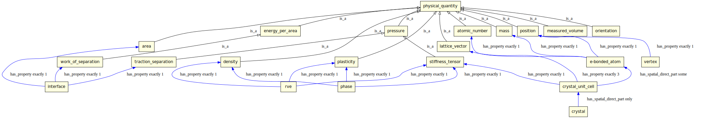
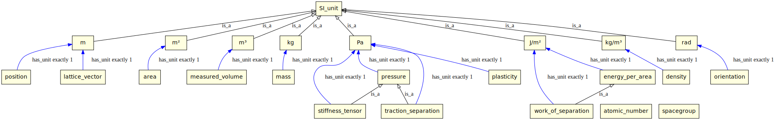
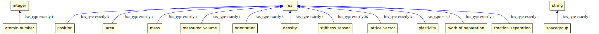
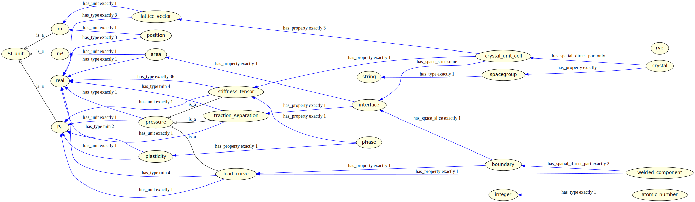
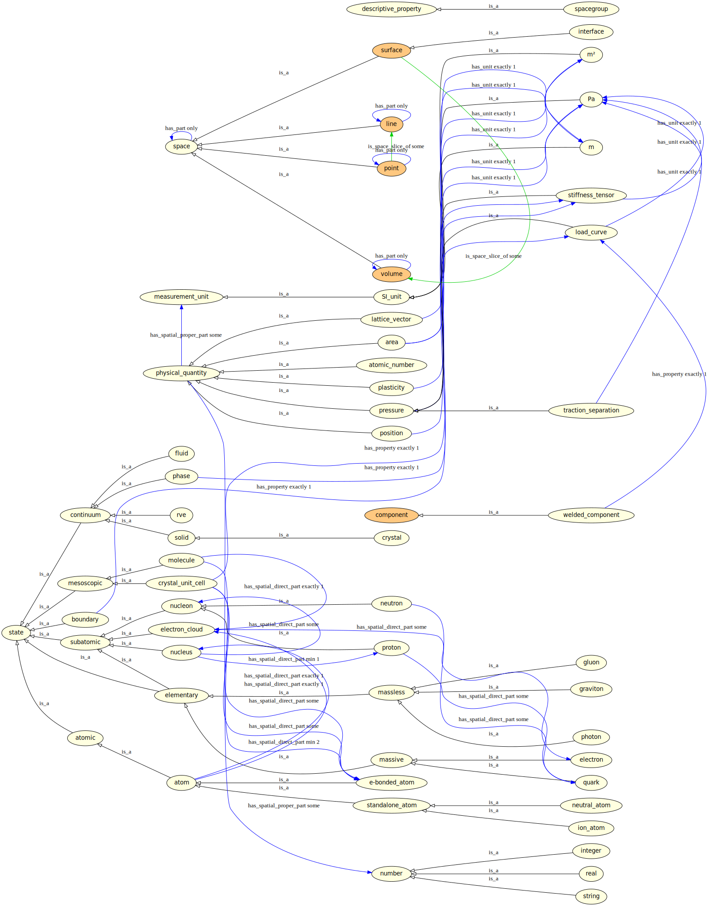

EMMO use case for vertical interoperability
===========================================
Vertical interoperability is about interoperability across two or more
granulaty levels.

In this use case we study the welded interface between an aluminium
and a steel plate at three granularity levels.  In this case, the
granularity levels corresponds to three different length scales, that
we here denote _component_, _microstructure_ and _atomistic_ scale.

Creating an EMMO-based user case ontology
-----------------------------------------
The script [define_ontology.py](define_ontology.py) uses the Python API
for EMMO to generate an application ontology extending EMMO with
additional concepts needed to describe the data that is exchanged
between scales.  The user case ontology can then be visualised with the
script [plot_ontology.py](plot_ontology.py).

### Defining the needed material entities

### Assigning properties to material entities

Note that we here also assign properties to `e-bonded_atom`, even though
`e-bonded_atom` is defined in EMMO.

### Assigning units to properties
We choose here to consistently use SI units for all scales (even
though at the atomistic scale units like Ångström and electron volt
are more commonly used).

### Assigning types to properties
In order to be able to generate metadata and to describe the actual data
transferred between scales, we also need to define types.

### The new application-ontology

The final plot shows the user case ontology in context of EMMO.

