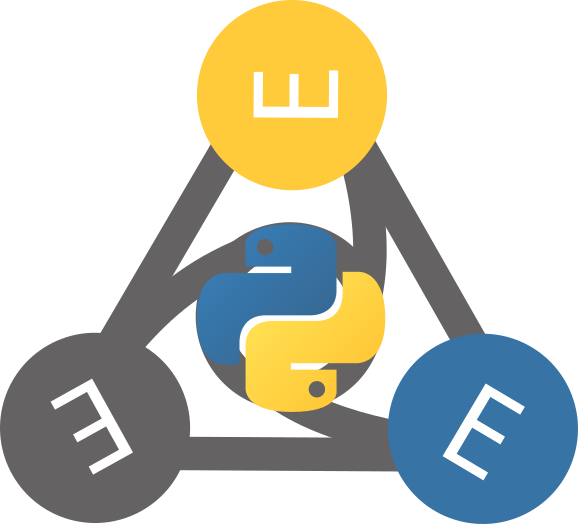
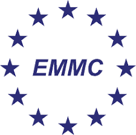

<!-- markdownlint-disable MD033 MD041 -->


# EMMOntoPy

*Library for representing and working with ontologies in Python.*


[](https://badge.fury.io/py/EMMOntoPy)
[](https://zenodo.org/badge/latestdoi/190286064)

EMMOntoPy is a Python package based on the excellent [Owlready2], which provides a natural and intuitive representation of ontologies in Python.
EMMOntoPy extends Owlready2 and adds additional functionality, like accessing entities by label, reasoning with FaCT++ and parsing logical expressions in Manchester syntax.
It also includes a set of tools, like creating an ontology from an Excel sheet, generation of reference documentation of ontologies and visualisation of ontologies graphically.
EMMOntoPy is freely available for on GitHub and on PyPI under the permissive open source [BSD 3-Clause license](LICENSE.md).

EMMOntoPy was originally developed to work effectively with the Elemental Multiperspective Material Ontology ([EMMO]) and EMMO-based domain ontologies.  
It has now two sub-packages, `ontopy` and `emmopy`, where `ontopy` is a general package to work with any OWL ontology, while `emmopy` provides extra features that are specific to [EMMO].

Owlready2, and thereby also EMMOntoPy, represents OWL classes and individuals in Python as classes and instances.
OWL properties are represented as Python attributes.
Hence, it provides a new *dot* notation for representing ontologies as valid Python code.
The notation is simple and easy to understand and write for people with some knowledge of OWL and Python.
Since Python is a versatile programming language, Owlready2 does not only allow for representation of OWL ontologies, but also to work with them programmatically, including interpretation, modification and generation.
Some of the additional features provided by EMMOntoPy are are listed below:

## Access by label
In Owlready2 ontological entities, like classes, properties and individuals are accessed by the name-part of their IRI (i.e. everything that follows after the final slash or hash in the IRI).
This is very inconvenient for ontologies like EMMO or Wikidata, that identify ontological entities by long numerical names.
For instance, the name-part of the IRI of the Atom class in EMMO is ‘EMMO_eb77076b_a104_42ac_a065_798b2d2809ad’, which is neither human readable nor easy to write.
EMMOntoPy allows to access the entity via its label (or rather skos:prefLabel) ‘Atom’, which is much more user friendly.

## Turtle serialisation/deserialisation
The Terse RDF Triple Language (Turtle) is a common syntax and file format for representing ontologies.
EMMOntoPy adds support for reading and writing ontologies in turtle format.

## FaCT++ reasoning
Owlready2 has only support for reasoning with HermiT and Pellet.
EMMOntoPy adds additional support for the fast tableaux-based [FaCT++ reasoner] for description logics.

## Manchester syntax
Even though the Owlready2 dot notation is clear and easy to read and understand for people who know Python, it is a new syntax that may look foreign for people that are used to working with Protégé.
EMMOntoPy provides support to parse and serialise logical expressions in [Manchester syntax], making it possible to create tools that will be much more familiar to work with for people used to working with Protégé.

## Visualisation
EMMOntoPy provides a Python module for graphical visualisation of ontologies.
This module allows to graphically represent not only the taxonomy, but also restrictions and logical constructs.
The classes to include in the graph, can either be specified manually or inferred from the taxonomy (like all subclasses of a give class that are not a subclass of any class in a set of other classes).

## Tools
EMMOntoPy includes a small set of command-line tools implemented as Python scripts:
  - [`ontoconvert`](tools-instructions.md#ontoconvert):
    Converts ontologies between different file formats.
    It also supports some additional transformation during conversion, like running a reasoner, merging several ontological modules together (squashing), rename IRIs, generate catalogue file and automatic annotation of entities with their source IRI.
  - [`ontograph`](tools-instructions.md#ontograph):
    Vertasile tool for visualising (parts of) an ontology, utilising the visualisation features mention above.
  - [`ontodoc`](tools-instructions.md#ontodoc):
    Documents an ontology.
  - [`excel2onto`](tools-instructions.md#excel2onto):
    Generate an EMMO-based ontology from an excel file.
    It is useful for domain experts with limited knowledge of ontologies and that are not used to tools like Protégé.
  - [`ontoversion`](tools-instructions.md#ontoversion):
    Prints ontology version number.
  - [`emmocheck`](tools-instructions.md#emmocheck):
    A small test framework for checking the consistency of EMMO and EMMO-based domain ontologies and whether they confirm to the EMMO conventions.

## Some examples of what you can do with EMMOntoPy includes:

- Access and query RDF-based ontologies from your application.
  This includes several different flavors of RDF (OWL, **Turtle (`ttl`)**, and more).
- Access and query EMMO-based ontologies from your application.
- Extend EMMO with new domain or application ontologies.
  This can be done both statically with easy readable Python code or dynamically within your application.
- Generate graphs and documentation of your ontologies.
  EMMOntoPy includes `ontodoc`: A dedicated command line tool for this.
  You find it in the [tools/](../tools) sub directory.
- Check that an EMMO-based domain or application ontology adhere to the conventions of EMMO.
- Interactively explore an ontology in any Python interpreter, e.g., [IPython].
  Tab-completion makes exploration easy and fast.
  Below is an example of an IPython session where we check the relations of `Matter` in EMMO utilizing the `emmopy.get_emmo` function:

  ```ipython
  In [1]: from emmopy import get_emmo

  In [2]: emmo = get_emmo()

  In [3]: emmo.Matter
  Out[3]: physicalistic.Matter

  In [4]: emmo.Matter.is_a
  Out[4]:
  [physicalistic.Physicalistic,
    physical.Physical,
    mereotopology.hasPart.some(physicalistic.Massive),
    physical.hasTemporalPart.only(physicalistic.Matter)]
  ```

## Documentation and examples

The [Owlready2 documentation][Owlready2-doc] is a good starting point.
The EMMOntoPy package also has its own [dedicated documentation](https://emmo-repo.github.io/EMMOntoPy).

This includes a few examples and demos:

- [demo/vertical](demo/vertical/README.md) shows an example of how EMMO may be used to achieve vertical interoperability.
  The file [define-ontology.py](demo/vertical/define_ontology.py) provides a good example for how an EMMO-based application ontology can be defined in Python.

- [demo/horizontal](demo/horizontal/README.md) shows an example of how EMMO may be used to achieve horizontal interoperability.
  This demo also shows how you can use EMMOntoPy to represent your ontology with the low-level metadata framework [DLite].
  In addition to achieve interoperability, as shown in the demo, DLite also allow you to automatically generate C or Fortran code base on your ontology.

- [examples/emmodoc](examples/emmodoc/README.md) shows how the documentation of EMMO is generated using the `ontodoc` tool.

## Installation

Install with:

```console
pip install EMMOntoPy
```

Minimal python dependencies can be found in requirements.txt.


If you want to install with extra functionalities:

- Reasoning:

For reasoning there are no extra python requirements, but JAVA is needed.

- Excel2onto:

For the functionality that allows for ontology creation from an excel or csv file:

```console
pip install EMMOntoPy[excel] # adds the extra python packages needed
```

Extra python packages needed are found in requirements_excel.txt.


- For the ontodoc and graph generation tools:

	- [Graphviz][graphviz_website]: Needed for graph generation.
  With support for generation pdf, png and svg figures for tests and generation of documentation automatically (`ontodoc`).
	- [pandoc]: Only used for generated documentation from markdown to nicely formatted html or pdf.
  Tested with v2.1.2.
	- [pdfLaTeX] or [XeLaTeX] and the `upgreek` LaTeX package (included in `texlive-was` on RetHat-based distributions and `texlive-latex-extra` on Ubuntu) for generation of pdf documentation.
  If your ontology contains exotic unicode characters, we recommend XeLaTeX.


```console
pip install EMMOntoPy[ontodoc] # extra python packages needed.
```

Extra python packages needed are found in requirements_ontodoc.txt.

- Extra efficiency

EMMOntPy builds on Owlready2 which has bult in extra efficiency with the optional package Cython.
This can be installed separately with:

```console
pip install Cython
```


See [docker-instructions.md](docker-instructions.md) for how to build a docker image.

### Known issues

- **Invalid serialising to turtle:** Due to rdflib issue [#1043](https://github.com/RDFLib/rdflib/issues/1043) `ontoconvert` may produce invalid turtle output (if your ontology contains real literals using scientific notation without a dot in the mantissa).
  This issue was fixed after the release of rdflib 5.0.0.
  Hence, install the latest rdflib from PyPI (`pip install --upgrade rdflib`) or directly from the source code repository: [GitHub](https://github.com/RDFLib/rdflib) if you need to serialise to turtle.

### Attributions and credits

EMMOntoPy is maintained by [EMMC-ASBL](https://emmc.eu/).
It has mainly been developed by [SINTEF](https://www.sintef.no/), specifically:

- Jesper Friis ([jesper-friis](https://github.com/jesper-friis))
- Francesca L. Bleken ([francescalb](https://github.com/francescalb))
- Casper W. Andersen ([CasperWA](https://github.com/CasperWA))
- Bjørn Tore Løvfall ([lovfall](https://github.com/lovfall))

### Contributing projects

- EMMC-CSA;
  Grant Agreement No: 723867
  

  The [EMMC-ASBL organization](https://emmc.eu/emmc-members/mission/) takes on the efforts of continuing and expanding on the efforts of the CSA.
- [MarketPlace](https://www.the-marketplace-project.eu/);
  Grant Agreement No: 760173
  
- [OntoTrans](https://ontotrans.eu/project/);
  Grant Agreement No: 862136
  
- [BIG-MAP](https://www.big-map.eu/);
  Grant Agreement No: 957189
  
- [OpenModel](https://www.open-model.eu/);
  Grant Agreement No: 953167
  

[EMMOntoPy]: https://github.com/emmo-repo/EMMOntoPy/
[Owlready2]: https://pypi.org/project/Owlready2/
[Owlready2-doc]: https://owlready2.readthedocs.io/
[EMMO]: https://emmo-repo.github.io
[PyPI:EMMOntoPy]: https://pypi.org/project/EMMOntoPy/
[Python]: https://www.python.org/
[IPython]: https://ipython.org/
[DLite]: https://github.com/SINTEF/dlite/
[graphviz_website]: https://www.graphviz.org/
[pandoc]: http://pandoc.org/
[XeLaTeX]: https://www.overleaf.com/learn/latex/XeLaTeX/
[pdfLaTeX]: https://www.latex-project.org/
[graphviz_python]: https://pypi.org/project/graphviz
[PyYAML]: https://pypi.org/project/PyYAML/
[blessings]: https://pypi.org/project/blessings/
[Pygments]: https://pypi.org/project/Pygments/
[rdflib]: https://pypi.org/project/rdflib/
[FaCT++]: http://owl.cs.manchester.ac.uk/tools/fact/
[Manchester syntax]: https://www.w3.org/TR/owl2-manchester-syntax/
