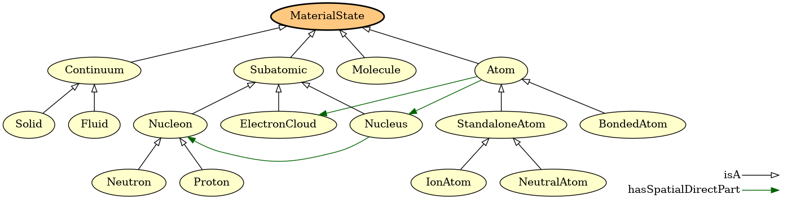

Instructions for tools available in EMMO-python
===============================================

**Content:**

- [emmocheck](#emmocheck)
- [ontoversion](#ontoversion)
- [ontograph](#ontograph)
- [ontodoc](#ontodoc)
- [ontoconvert](#ontoconvert)

---

emmocheck
---------
Tool for checking that ontologies conform to EMMO conventions.

### Usage:

    emmocheck [options] iri

### Options:

    positional arguments:
      iri                   File name or URI to the ontology to test.

    optional arguments:
      -h, --help            show this help message and exit
      --database FILENAME, -d FILENAME
                            Load ontology from Owlready2 sqlite3 database. The
                            `iri` argument should in this case be the IRI of the
                            ontology you want to check.
      --local, -l           Load imported ontologies locally. Their paths are
                            specified in Protégé catalog files or via the --path
                            option. The IRI should be a file name.
      --catalog-file CATALOG_FILE
                            Name of Protégé catalog file in the same folder as the
                            ontology. This option is used together with --local
                            and defaults to "catalog-v001.xml".
      --path PATH           Paths where imported ontologies can be found. May be
                            provided as a comma-separated string and/or with
                            multiple --path options.
      --check-imported, -i  Whether to check imported ontologies.
      --verbose, -v         Verbosity level.
      --configfile CONFIGFILE, -c CONFIGFILE
                            A yaml file with additional test configurations.
      --skip, -s ShellPattern
        		    Shell pattern matching tests to skip.  This option may be
                            provided multiple times.
      --url-from-catalog, -u 
			    Get url from catalog file.
      --ignore-namespace, -n
                            Namespace to be ignored. Can be given multiple times

### Examples:

    emmocheck http://emmo.info/emmo/1.0.0-alpha2
    emmocheck --database demo.sqlite3 http://www.emmc.info/emmc-csa/demo#
    emmocheck -l emmo.owl (in folder to which emmo was downloaded locally) 
    emmocheck --check-imported --ignore-namespace=physicalistic --verbose --url-from-catalog emmo.owl (in folder with downloaded EMMO)
    emmocheck --check-imported --local --url-from-catalog --skip test_namespace emmo.owl 
(Missing example with local and path)

### Example configuration file:
Example of YAML configuration file provided with the --configfile option
that will omit `myunits.MyUnitCategory1` and `myunits.MyUnitCategory1`
from the _unit dimensions test_.

    test_unit_dimensions:
      exceptions:
        - myunits.MyUnitCategory1
        - myunits.MyUnitCategory2

---

ontoversion
-----------
Prints version of an ontology to standard output.

This script uses rdflib and the versionIRI tag of the ontology to infer
the version.

### Usage:

    ontoversion [options] iri

### Special dependencies:
- rdflib (python package)

### Options:

    positional arguments:
      IRI                   IRI/file to OWL source to extract the version from.

    optional arguments:
      -h, --help            show this help message and exit
      --format FORMAT, -f FORMAT
                            OWL format. Default is "xml".

### Examples:

    ontoversion http://emmo.info/emmo/1.0.0-alpha

Comment: Fails if ontology has no versionIRI tag.

---

ontograph
---------
Tool for visualizing ontologies.

### Usage:

    ontograph [options] iri [output]

### Dependencies:
- Graphviz

### Options:

    positional arguments:
      IRI                   File name or URI of the ontology to visualise.
      output                name of output file.

    optional arguments:
      -h, --help            show this help message and exit
      --format FORMAT, -f FORMAT
                            Format of output file. By default it is inferred from
                            the output file extension.
      --database FILENAME, -d FILENAME
                            Load ontology from Owlready2 sqlite3 database. The
                            `iri` argument should in this case be the IRI of the
                            ontology you want to visualise.
      --local, -l           Load imported ontologies locally. Their paths are
                            specified in Protégé catalog files or via the --path
                            option. The IRI should be a file name.
      --catalog-file CATALOG_FILE
                            Name of Protégé catalog file in the same folder as the
                            ontology. This option is used together with --local
                            and defaults to "catalog-v001.xml".
      --path PATH           Paths where imported ontologies can be found. May be
                            provided as a comma-separated string and/or with
                            multiple --path options.
      --reasoner [{HermiT,Pellet}]
                            Run given reasoner on the ontology. Valid reasoners
                            are "HermiT" (default) and "Pellet". Note: these
                            reasoners doesn't work well with EMMO.
      --root ROOT, -r ROOT  Name of root node in the graph. Defaults to all
                            classes.
      --leafs LEAFS         Leafs nodes for plotting sub-graphs. May be provided
                            as a comma-separated string and/or with multiple
                            --leafs options.
      --exclude EXCLUDE, -E EXCLUDE
                            Nodes, including their subclasses, to exclude from
                            sub-graphs. May be provided as a comma-separated
                            string and/or with multiple --exclude options.
      --parents N, -p N     Adds N levels of parents to graph.
      --relations RELATIONS, -R RELATIONS
                            Comma-separated string of relations to visualise.
                            Default is "isA". "all" means include all relations.
      --edgelabels, -e      Whether to add labels to edges.
      --addnodes, -n        Whether to add missing target nodes in relations.
      --addconstructs, -c   Whether to add nodes representing class constructs.
      --rankdir {BT,TB,RL,LR}
                            Graph direction (from leaves to root). Possible values
                            are: "BT" (bottom-top, default), "TB" (top-bottom),
                            "RL" (right-left) and "LR" (left-right).
      --style-file JSON_FILE, -s JSON_FILE
                            A json file with style definitions.
      --legend, -L          Whether to add a legend to the graph.
      --generate-style-file JSON_FILE, -S JSON_FILE
                            Write default style file to a json file.
      --plot-modules, -m    Whether to plot module inter-dependencies instead of
                            their content.
      --display, -D         Whether to display graph.

### Examples:
The figure below is e.g. generated with the following command

    ontograph --root=MaterialState --relations=all --legend emmo-inferred materialstate.png

---

ontodoc
-------
Tool for documenting ontologies.

### Usage:

    ontodoc [options] iri outfile

### dependencies:
- pandoc
- pdflatex or xelatex

### Options:

positional arguments:
  IRI                   File name or URI of the ontology to document.
  OUTFILE               Output file.

    optional arguments:
      -h, --help            show this help message and exit
      --database FILENAME, -d FILENAME
                            Load ontology from Owlready2 sqlite3 database. The
                            `iri` argument should in this case be the IRI of the
                            ontology you want to document.
      --local, -l           Load imported ontologies locally. Their paths are
                            specified in Protégé catalog files or via the --path
                            option. The IRI should be a file name.
      --catalog-file CATALOG_FILE
                            Name of Protégé catalog file in the same folder as the
                            ontology. This option is used together with --local
                            and defaults to "catalog-v001.xml".
      --path PATH           Paths where imported ontologies can be found. May be
                            provided as a comma-separated string and/or with
                            multiple --path options.
      --reasoner [{HermiT,Pellet}]
                            Run given reasoner on the ontology. Valid reasoners
                            are "HermiT" (default) and "Pellet". Note: these
                            reasoners doesn't work well with EMMO.
      --template FILE, -t FILE
                            ontodoc input template. If not provided, a simple
                            default template will be used. Don't confuse it with
                            the pandoc templates.
      --format FORMAT, -f FORMAT
                            Output format. May be "md", "simple-html" or any other
                            format supported by pandoc. By default the format is
                            inferred from --output.
      --figdir DIR, -D DIR  Default directory to store generated figures. If a
                            relative path is given, it is relative to the template
                            (see --template), or the current directory, if
                            --template is not given. Default: "genfigs"
      --figformat FIGFORMAT, -F FIGFORMAT
                            Format for generated figures. The default is inferred
                            from --format."
      --max-figwidth MAX_FIGWIDTH, -w MAX_FIGWIDTH
                            Maximum figure width. The default is inferred from
                            --format.
      --pandoc-option STRING, -p STRING
                            Additional pandoc long options overriding those read
                            from --pandoc-option-file. It is possible to remove
                            pandoc option --XXX with "--pandoc-option=no-XXX".
                            This option may be provided multiple times.
      --pandoc-option-file FILE, -P FILE
                            YAML file with additional pandoc options. Note, that
                            default pandoc options are read from the files
                            "pandoc-options.yaml" and "pandoc-FORMAT-options.yaml"
                            (where FORMAT is format specified with --format). This
                            option allows to override the defaults and add
                            additional pandoc options. This option may be provided
                            multiple times.
      --keep-generated FILE, -k FILE
                            Keep a copy of generated markdown input file for
                            pandoc (for debugging).

### Examples:
Basic documentation of an ontology `demo.owl` can e.g. be generated with

    ontodoc --format=simple-html --local demo.owl demo.html

See [examples/emmodoc/README.md](../examples/emmodoc/README.md) for
how this tool is used to generate the
[html](https://emmo-repo.github.io/latest/emmo.html) and
[pdf](https://emmo-repo.github.io/latest/emmo.pdf) documentation of
EMMO itself.

---

ontoconvert
-------
Tool for converting between different ontology formats

### Usage:

    ontodoc [options] inputfile outputfile

### dependencies:
- rdflib

### Options:

positional arguments:
  INPUTFILE              Name of inputfile.
  OUTPUTFILE             Name og output file.

    optional arguments:
      -h, --help            show this help message and exit
      --input-format, -f INPUT_FORMAT 
                            Inputformat. Default is to infer from input.
      --output-format, -F OUTPUT_FORMAT
			    Default is to infer from output.
      --recursive, -r       The output is written to the directories matching the input. This requires Protege catalog files to be present.
      --squash, -s          Squash imported ontologies into a single output file.

### Examples:

    ontoconvert --recursive emmo.ttl emmo.owl

Note that it is then required to add argument only_local=True when loading the ontology in emmopython, e.g.
    python
    >from emmo import get_ontology
    >o=get_ontology('emmo.owl').load(only_local=True)

Also, since the catalog file will be overwritten in the above example writing output to a separate directory is useful.
   ontoconvert --recursive emmo.ttl owl/emmo.owl

