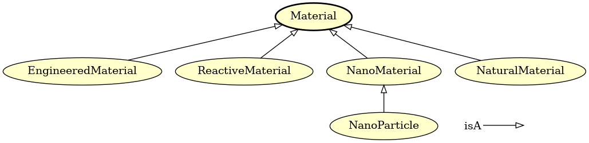

# Instructions for tools available in EMMOntoPy

<!-- markdownlint-disable MD024 -->

**Content:**

- [emmocheck](#emmocheck)
- [ontoversion](#ontoversion)
- [ontograph](#ontograph)
- [ontodoc](#ontodoc)
- [ontoconvert](#ontoconvert)
- [excel2onto](#excel2onto)

---

## `emmocheck`

Tool for checking that ontologies conform to EMMO conventions.

### Usage

```console
emmocheck [options] iri
```

### Options

```console
positional arguments:
  iri                   File name or URI to the ontology to test.

optional arguments:
  -h, --help            show this help message and exit
  --database FILENAME, -d FILENAME
                        Load ontology from Owlready2 sqlite3 database. The
                        `iri` argument should in this case be the IRI of the
                        ontology you want to check.
  --local, -l           Load imported ontologies locally. Their paths are
                        specified in Protégé catalog files or via the --path
                        option. The IRI should be a file name.
  --catalog-file CATALOG_FILE
                        Name of Protégé catalog file in the same folder as the
                        ontology. This option is used together with --local
                        and defaults to "catalog-v001.xml".
  --path PATH           Paths where imported ontologies can be found. May be
                        provided as a comma-separated string and/or with
                        multiple --path options.
  --check-imported, -i  Whether to check imported ontologies.
  --verbose, -v         Verbosity level.
  --configfile CONFIGFILE, -c CONFIGFILE
                        A yaml file with additional test configurations.
  --skip, -s ShellPattern
            Shell pattern matching tests to skip.  This option may be
                        provided multiple times.
  --url-from-catalog, -u
      Get url from catalog file.
  --ignore-namespace, -n
                        Namespace to be ignored. Can be given multiple times
```

### Examples

```console
    emmocheck http://emmo.info/emmo/1.0.0-alpha2
    emmocheck --database demo.sqlite3 http://www.emmc.info/emmc-csa/demo#
    emmocheck -l emmo.owl (in folder to which emmo was downloaded locally)
    emmocheck --check-imported --ignore-namespace=physicalistic --verbose --url-from-catalog emmo.owl (in folder with downloaded EMMO)
    emmocheck --check-imported --local --url-from-catalog --skip test_namespace emmo.owl
```
<!-- (Missing example with local and path) -->


### Configuration file
The `--configfile` options expects a YAML configuration file that specifies what tests to skip or enable.

The following keywords are recognised in the YAML file:

  - `skip`: List of tests to skip
  - `enable`: List of tests to enable
  - `<test_name>`: A name of a test. Recognised nested keywords are:
    - `exceptions`: List of entities in the ontology to skip. Should be written
      as `<ns0>.<name>`, where `<ns0>` is the last component of the base IRI
      and `<name>` is the name of the entity.
    - `skipmodules`: List of module names to skip the test for. The module
      names may be written either as the full module IRI or as the last
      component of the module IRI.

Example configuration file:

```console
test_description:
  skipmodules:
    - manufacturing
    - conformityassessment

test_unit_dimensions:
  exceptions:
    - myunits.MyUnitCategory1
    - myunits.MyUnitCategory2

skip:
  - name_of_test_to_skip

enable:
  - name_of_test_to_enable
```

---

## `ontoversion`

Prints version of an ontology to standard output.

This script uses [RDFLib](https://rdflib.readthedocs.io/en/stable/) and the versionIRI tag of the ontology to infer the version.

### Usage

```console
ontoversion [options] iri
```

### Special dependencies

- `rdflib` (Python package)

### Options

```console
positional arguments:
  IRI                   IRI/file to OWL source to extract the version from.

optional arguments:
  -h, --help            show this help message and exit
  --format FORMAT, -f FORMAT
                        OWL format. Default is "xml".
```

### Examples

```console
ontoversion http://emmo.info/emmo/1.0.0-alpha
```

!!! warning
    Fails if ontology has no versionIRI tag.

---

## `ontograph`

Tool for visualizing ontologies.

### Usage

```console
ontograph [options] iri [output]
```

### Dependencies

- Graphviz

### Options

```console
positional arguments:
  IRI                   File name or URI of the ontology to visualise.
  output                name of output file.

optional arguments:
  -h, --help            show this help message and exit
  --format FORMAT, -f FORMAT
                        Format of output file. By default it is inferred from
                        the output file extension.
  --database FILENAME, -d FILENAME
                        Load ontology from Owlready2 sqlite3 database. The
                        `iri` argument should in this case be the IRI of the
                        ontology you want to visualise.
  --local, -l           Load imported ontologies locally. Their paths are
                        specified in Protégé catalog files or via the --path
                        option. The IRI should be a file name.
  --catalog-file CATALOG_FILE
                        Name of Protégé catalog file in the same folder as the
                        ontology. This option is used together with --local
                        and defaults to "catalog-v001.xml".
  --path PATH           Paths where imported ontologies can be found. May be
                        provided as a comma-separated string and/or with
                        multiple --path options.
  --reasoner [{FaCT++,HermiT,Pellet}]
                        Run given reasoner on the ontology. Valid reasoners
                        are "FaCT++" (default), "HermiT" and "Pellet".
                        Note: FaCT++ is preferred with EMMO.
  --root ROOT, -r ROOT  Name of root node in the graph. Defaults to all
                        classes.
  --leaves LEAVES       Leaf nodes for plotting sub-graphs. May be provided
                        as a comma-separated string and/or with multiple
                        --leaves options.
  --exclude EXCLUDE, -E EXCLUDE
                        Nodes, including their subclasses, to exclude from
                        sub-graphs. May be provided as a comma-separated
                        string and/or with multiple --exclude options.
  --parents N, -p N     Adds N levels of parents to graph.
  --relations RELATIONS, -R RELATIONS
                        Comma-separated string of relations to visualise.
                        Default is "isA". "all" means include all relations.
  --edgelabels, -e      Whether to add labels to edges.
  --addnodes, -n        Whether to add missing target nodes in relations.
  --addconstructs, -c   Whether to add nodes representing class constructs.
  --rankdir {BT,TB,RL,LR}
                        Graph direction (from leaves to root). Possible values
                        are: "BT" (bottom-top, default), "TB" (top-bottom),
                        "RL" (right-left) and "LR" (left-right).
  --style-file JSON_FILE, -s JSON_FILE
                        A json file with style definitions.
  --legend, -L          Whether to add a legend to the graph.
  --generate-style-file JSON_FILE, -S JSON_FILE
                        Write default style file to a json file.
  --plot-modules, -m    Whether to plot module inter-dependencies instead of
                        their content.
  --display, -D         Whether to display graph.
```

### Examples


```console
ontograph --relations=all --legend --format=pdf emmo-inferred emmo.pdf # complete ontology
ontograph --root=Holistic --relations=hasInput,hasOutput,hasTemporaryParticipant,hasAgent --parents=2 --legend --leaves=Measurement,Manufacturing,CompleteManufacturing,ManufacturedProduct,CommercialProduct,Manufacturer --format=png --exclude=Task,Workflow,Computation,MaterialTreatment emmo-inferred measurement.png
ontograph --root=Material --relations=all --legend --format=png emmo-inferred material.png
```
The figure below is generated with the last command in the list above.


---

## `ontodoc`

Tool for documenting ontologies.

### Usage

```console
ontodoc [options] iri outfile
```

### Dependencies

- pandoc
- pdflatex or xelatex

### Options

```console
positional arguments:
  IRI                   File name or URI of the ontology to document.
  OUTFILE               Output file.

    optional arguments:
      -h, --help            show this help message and exit
      --database FILENAME, -d FILENAME
                            Load ontology from Owlready2 sqlite3 database. The
                            `iri` argument should in this case be the IRI of the
                            ontology you want to document.
      --local, -l           Load imported ontologies locally. Their paths are
                            specified in Protégé catalog files or via the --path
                            option. The IRI should be a file name.
      --imported, -i        Include imported ontologies
      --no-catalog, -n      Do not read url from catalog even if it exists.
      --catalog-file CATALOG_FILE
                            Name of Protégé catalog file in the same folder as the
                            ontology. This option is used together with --local
                            and defaults to "catalog-v001.xml".
      --path PATH           Paths where imported ontologies can be found. May be
                            provided as a comma-separated string and/or with
                            multiple --path options.
      --reasoner [{FaCT++,HermiT,Pellet}]
                            Run given reasoner on the ontology. Valid reasoners
                            are "FaCT++" (default), "HermiT" and "Pellet".
                            Note: FaCT++ is preferred with EMMO.
      --template FILE, -t FILE
                            ontodoc input template. If not provided, a simple
                            default template will be used. Don't confuse it with
                            the pandoc templates.
      --format FORMAT, -f FORMAT
                            Output format. May be "md", "simple-html" or any other
                            format supported by pandoc. By default the format is
                            inferred from --output.
      --figdir DIR, -D DIR  Default directory to store generated figures. If a
                            relative path is given, it is relative to the template
                            (see --template), or the current directory, if
                            --template is not given. Default: "genfigs"
      --figformat FIGFORMAT, -F FIGFORMAT
                            Format for generated figures. The default is inferred
                            from --format."
      --max-figwidth MAX_FIGWIDTH, -w MAX_FIGWIDTH
                            Maximum figure width. The default is inferred from
                            --format.
      --pandoc-option STRING, -p STRING
                            Additional pandoc long options overriding those read
                            from --pandoc-option-file. It is possible to remove
                            pandoc option --XXX with "--pandoc-option=no-XXX".
                            This option may be provided multiple times.
      --pandoc-option-file FILE, -P FILE
                            YAML file with additional pandoc options. Note, that
                            default pandoc options are read from the files
                            "pandoc-options.yaml" and "pandoc-FORMAT-options.yaml"
                            (where FORMAT is format specified with --format). This
                            option allows to override the defaults and add
                            additional pandoc options. This option may be provided
                            multiple times.
      --keep-generated FILE, -k FILE
                            Keep a copy of generated markdown input file for
                            pandoc (for debugging).
```

### Examples

Basic documentation of an ontology `demo.owl` can be generated with:

```console
ontodoc --format=simple-html --local demo.owl demo.html
```

See [examples/emmodoc/README.md](examples/emmodoc/README.md) for how this tool is used to generate the [html](https://emmo-repo.github.io/latest/emmo.html) and [pdf](https://emmo-repo.github.io/latest/emmo.pdf) documentation of EMMO itself.

---

## `ontoconvert`

Tool for converting between different ontology formats and annotating ontologies.

### Usage

```console
ontoconvert [options] inputfile outputfile
```

### Dependencies

- `rdflib` (Python package)

### Options

```console
positional arguments:
  input                 IRI/file to OWL source.
  output                Output file name.

options:
  -h, --help            show this help message and exit
  --input-format INPUT_FORMAT, -f INPUT_FORMAT
                        Input format (default is to infer from input). Available formats: "xml"
                        (rdf/xml), "n3", "nt", "trix", "rdfa"
  --output-format OUTPUT_FORMAT, -F OUTPUT_FORMAT
                        Output format (default is to infer from output. Available formats: "xml"
                        (rdf/xml), "n3", "turtle", "nt", "pretty-xml", "trix"
  --output-dir OUTPUT_DIR, -d OUTPUT_DIR
                        Output directory. If `output` is a relative path, it will be relative to
                        this directory.
  --overwrite, -w       Whether to remove `output` if it already exists. The default is to append
                        to it.
  --copy-annotation FROM-->TO, -c FROM-->TO
                        Copy annotation FROM to annotation TO in each class and property in the
                        ontology. FROM and TO may be given as full IRIs or (if they already exists
                        as annotations in the ontology) as entity names. This option be given
                        multiple times.
  --copy-emmo-annotations, -e
                        Make a copy of EMMO annotations to plain RDFS for increased
                        interoperability. Alias for: `--copy-annotation=http://www.w3.org/2004/02/s
                        kos/core#prefLabel-->http://www.w3.org/2000/01/rdf-schema#label --copy-
                        annotation=elucidation-->http://www.w3.org/2000/01/rdf-schema#comment`
                        --copy-annotation=definition-->http://www.w3.org/2000/01/rdf-
                        schema#comment` --copy-annotation=comment-->http://www.w3.org/2000/01/rdf-
                        schema#comment`
  --namespace PREFIX:NAMESPACE, -n PREFIX:NAMESPACE
                        Additional prefix:namespace pair that will be added to the header of turtle
                        output. The argument can be used multiple times, once for each added
                        prefix:namespace pair.
  --no-catalog, -N      Whether to not read catalog file even if it exists.
  --reasoner [NAME], --infer [NAME], -i [NAME]
                        Add additional relations inferred by the reasoner. Supported reasoners are
                        "HermiT" (default), "Pellet" and "FaCT++".
  --no-infer-imported, --no-reason-imported
                        Do not infer imported ontologies.
  --java-executable JAVA_EXECUTABLE
                        Path to Java executable to use. Default is `java`.
  --java-memory JAVA_MEMORY
                        Maximum memory allocated to Java in MB. Default is 2000.
  --iri IRI, -I IRI     IRI of converted ontology.
  --base-iri BASE_IRI, -b BASE_IRI
                        Base IRI of converted ontology. The default is the base iri of the input
                        ontology. This argument can be used to workaround the bug in Owlready2 that
                        changes the base IRI of the ontology to always end with a slash.
  --quiet, -q           Don't print a lot of stuff to stdout during reasoning.
  --recursive, -r       Whether to also convert imported ontologies recursively using rdflib. The
                        output is written to a directory structure matching the input. This option
                        requires Protege catalog files to be present. It is typically combined with
                        --output-dir.
  --squash, -s          Whether to also squash imported ontologies into a single output file. When
                        combining --squash with --recursive, a folder structure of overlapping
                        single-file ontologies will be generated.
  --annotate-source, -a
                        Whether to annotate all entities with the base IRI of the source ontology
                        using `rdfs:isDefinedBy` relations. This is contextual information that is
                        otherwise lost when ontologies are inferred and/or squashed.
  --rename-iris [ANNOTATION], -R [ANNOTATION]
                        For all entities that have the given annotation ('prefLabel' by default),
                        change the name of the entity to the value of the annotation. For all
                        changed entities, an `equivalentTo` annotation is added, referring to the
                        old name. This option is useful to create a copy of an ontology with more
                        human readable IRIs.
  --rename-ontology |REGEX|REPL|
                        Rename all ontologies matching regular expression `REGEX` to `REPL`, using
                        the function `re.sub()`. The argument should start and end with the
                        character used to separate the `REGEX` from the `REPL` strings.
  --catalog-file [FILENAME], -C [FILENAME]
                        Whether to write catalog file. Defaults to "catalog-v001.xml".
  --append-catalog, -A  Whether to append to (possible) existing catalog file.

```

### Examples

```console
ontoconvert --recursive emmo.ttl owl/emmo.owl
ontoconvert --inferred emmo.ttl emmo-inferred.owl
```

Note, it is then required to add the argument `only_local=True` when loading the locally converted ontology in EMMOntoPy, e.g.:

```python
from ontopy import get_ontology

emmo_ontology = get_ontology("emmo.owl").load(only_local=True)
```

Since the catalog file will be overwritten in the above example writing output to a separate directory is useful.

```console
ontoconvert --recursive emmo.ttl owl/emmo.owl
```

The following will create a squashed and renamed copy of an ontology (with "/myonto/1.2.3" replaced by "/myonto/1.3.0"):

```console
ontoconvert --squash --rename-ontology "|/myonto/1.2.3|/myonto/1.3.0|" myonto.ttl myonto-squashed.ttl
```


### Bugs
Since parsing the results from the reasoner is currently broken in Owlready2 (v0.37), a workaround has been added to ontoconvert.
This workaround only only supports FaCT++.  Hence, HermiT and Pellet are currently not available.


## `excel2onto`

Tool for converting EMMO-based ontologies from Excel to OWL, making it easy for non-ontologists to make EMMO-based domain ontologies.

The Excel file must be in the format provided by ontology_template.xlsx.

### Usage

```console
excel2onto [options] excelpath
```

### Dependencies

- `pandas` (Python package)

### Options

```console
positional arguments:
  excelpath             path to excel book

options:
  -h, --help            show this help message and exit
  --output OUTPUT, -o OUTPUT
                        Name of output ontology, ´ontology.ttl´ is default
  --force, -f           Whether to force generation of ontology on non-fatal
                        error.
```

See [the documentation of the python api](api_reference/ontopy/excelparser.md) for a thorough description of the requirements on the Excel workbook.

### Examples

Create a `new_ontology.ttl` turtle file from the Excel file `new_ontology.xlsx`:
```console
excel2onto -o new_ontology.ttl new_ontology.xlsx
```


### Bugs

`equivalentTo` is currently not supported.
